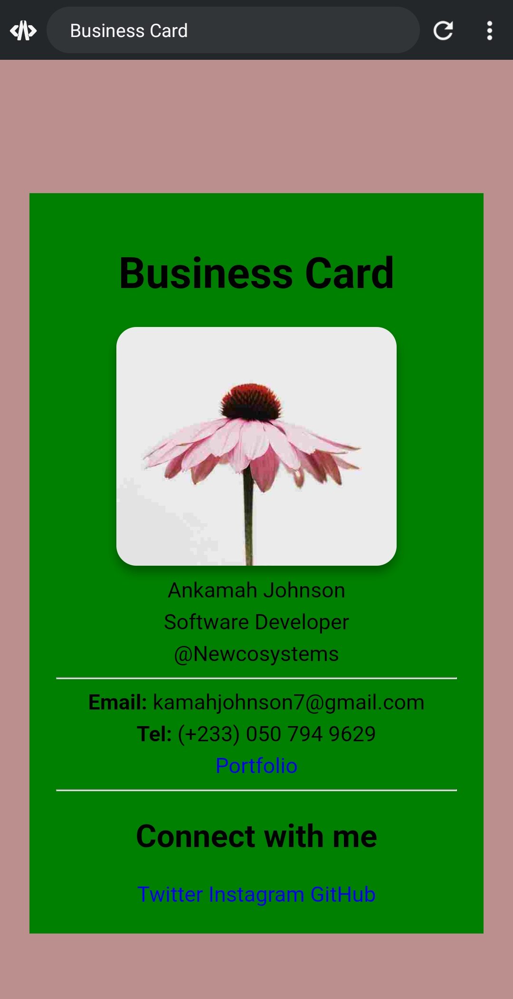

# Digital Business Card
A clean, responsive business card designed with "HTML" and "CSS".

  <!-- Add a screenshot later -->

## Features
- Fully responsive (works on mobile & desktop)
- CSS styling (margin/padding, text alignment, font size, anchor-link effects, border radius/effects, background color, etc.)
- Easy to customize colors and content

## Tech Stack
- HTML5
- CSS

## Live Demo
[View Live Business Card]🌐([https://ankamahjohnson.github.io/digital-business-card](https://ankamahjohnson.github.io/Digital-business-card/)  <!-- This link appears after Step 5 -->

## How to View Locally
1. Clone the repo: `git clone https://github.com/ankamahjohnson/business-card.git`
2. Open `index.html` in your browser.

## What I Learned
- Responsive design techniques
- CSS margin/padding, text alignment, font size, anchor-link effects, border radius/effects, background color, etc.

Made with ❤️ as a frontend practice project.
